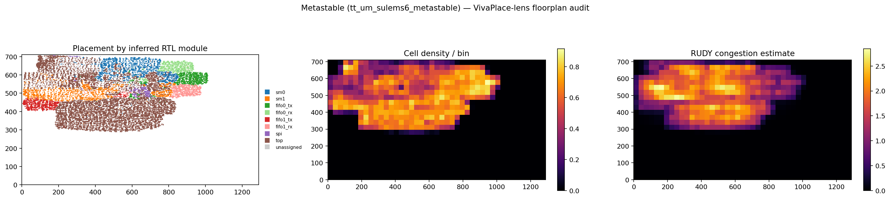
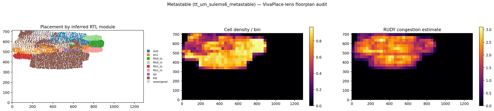

# Floorplan audit

A physical-design audit of the hardened macro, run with the analysis lenses
from [VivaPlace](https://github.com/SameerSul/leetfm-macro-place-challenge-2026)
(hierarchy-preserving macro placement): its LEF/DEF readers, the three proxy
metrics its placer optimizes (HPWL wirelength, density grid, RUDY congestion),
and its core idea — inferring RTL hierarchy from netlist connectivity — applied
to OpenROAD's flat standard-cell placement.



## Method

Yosys anonymizes combinational instance names, but 543 nets keep RTL register
names (`sms[0].*`, `fifos[1].u_rx.*`, `u_spi.*`). Each flip-flop driving a
named net seeds a module label (1272 FFs); labels then propagate to all 13.8k
functional cells by majority vote over net neighbours — the same
connectivity-based hierarchy inference VivaPlace uses when module boundaries
are hidden. Nets with more than 32 pins (clock, reset) are skipped, as they
carry no locality information.

## Findings (commit 91a8235, LibreLane run of 2026-09-19)

| Metric | Value |
|---|---|
| Die | 1289 x 711 um (6x4 tiles), utilization 22% |
| HPWL (audit) | 556k um — matches OpenROAD's 551k estimate |
| Density | max 0.91/bin, blob packs at ~0.6-0.9 local |
| RUDY congestion | max 2.8, mean 0.56 — large headroom |
| Worst setup slack | +0.34 ns @ slow corner (1.08 V, 125 C) |

Hierarchy cohesion (ideal RMS spread of a compact square / actual RMS spread;
1.0 = perfectly compact):

| Module | Cells | Spread (um) | Cohesion |
|---|---|---|---|
| sm0 | 1600 | 139 | 0.50 |
| sm1 | 1666 | 222 | 0.32 |
| fifo0_rx | 503 | 91 | 0.51 |
| fifo0_tx | 681 | 148 | 0.34 |
| fifo1_rx | 495 | 155 | 0.30 |
| fifo1_tx | 532 | 146 | 0.31 |
| spi | 239 | 149 | 0.20 |

The flat wirelength-driven placement scatters SM1's cluster across 900 um of
die width, with its TX FIFO centroid at x=149 and its RX FIFO centroid at
x=828. The worst setup path pays for exactly this: an SM1 decode register
(4 logic levels downstream of `pc[1][0]`, 682 sinks through its buffer tree)
at (462, 469) reaching `fifos[1].u_rx.mem[2][2]` at (903, 541) through 24
repeater stages — ~700 um of physical wander for +0.34 ns residual slack.
This is the failure mode VivaPlace treats as its primary objective: a proxy
optimizer has no reason to keep a tightly-connected subsystem together, and
here the scatter lands directly on the critical path.

## Experiment: PL_TARGET_DENSITY_PCT 60 -> 75

Branch `fp-density-75` tested the one available knob; congestion headroom
said tighter packing was safe, and the audit's diagnosis held up:

| Metric | density 60 | density 75 |
|---|---|---|
| Setup WS @ slow corner | +0.34 ns | **+1.45 ns** |
| Hold WS @ fast corner | +0.12 ns | +0.13 ns |
| HPWL (audit) | 556k um | 530k um |
| sm0 / sm1 cohesion | 0.50 / 0.32 | 0.57 / 0.36 |
| fifo1_tx cohesion | 0.31 | 0.38 |
| Antenna violations | 0 | 1 (Metal3, 2x over) |

4.3x the setup margin from one placement knob — the die-wide scatter, not
logic depth, was the bottleneck. Merged to `cmos5l`.
The density-75 placement: 

The single antenna is accepted after two repair attempts documented in
the branch history: raising `GRT_ANTENNA_REPAIR_MARGIN` was a bit-exact
no-op (the GRT-stage repair already converges to zero; net3308 only
violates after detailed routing, which this flow never re-repairs), and
`RUN_HEURISTIC_DIODE_INSERTION` first crashed on a CMOS5L PDK config bug
(`DIODE_CELL` ships without the `/pin` suffix the Odb scripts require)
and then, with the pin fixed, made detailed routing blow the 6-hour CI
job limit under the PDK's zero cell padding. A 2x-over cumulative-area
ratio on one buffer input is a modest manufacture-time risk; the 1.1 ns
of recovered setup margin is kept.

## Reproducing

```
gh run download <gds-run-id> -n GDS_logs -D gds_logs
curl -LO https://raw.githubusercontent.com/IHP-GmbH/IHP-Open-PDK/<pdk-commit>/ihp-sg13cmos5l/libs.ref/sg13cmos5l_stdcell/lef/sg13cmos5l_stdcell.lef
cd <vivaplace-repo> && uv run python <this-dir>/floorplan_audit.py \
    gds_logs/runs/wokwi/final/def/tt_um_sulems6_metastable.def \
    sg13cmos5l_stdcell.lef out/
```
