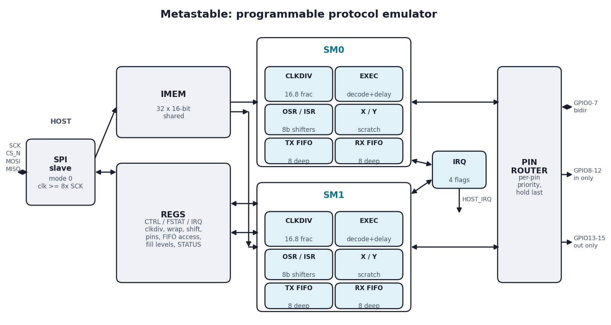
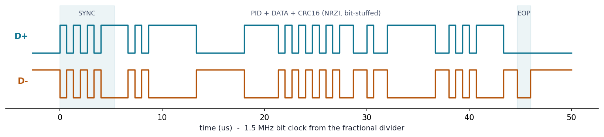

## How it works

Metastable is a general-purpose protocol emulator: two RP2040-PIO-inspired
programmable state machines that bit-bang protocols (UART, SPI, I2C, and
anything else that fits the timing) entirely in "firmware" loaded after
fabrication.

Each state machine executes one 16-bit instruction per divided-clock tick
from a shared 32-entry instruction memory:

| Opcode | Instruction | Function |
|--------|-------------|----------|
| 000 | `JMP cond, addr` | conditions: always, !X, X--, !Y, Y--, X!=Y, PIN, !OSRE |
| 001 | `WAIT pol, src, idx` | stall on GPIO / relative pin / IRQ flag |
| 010 | `IN src, n` | shift 1-8 bits into ISR (pins, X, Y, null, ISR, OSR) |
| 011 | `OUT dst, n` | shift 1-8 bits out of OSR (pins, X, Y, pindirs, PC, ISR) |
| 100 | `PUSH` / `PULL` | ISR -> RX FIFO / TX FIFO -> OSR, blocking or not |
| 101 | `MOV dst, op(src)` | copy/invert/bit-reverse; `MOV EXEC` injects a computed jump |
| 110 | `IRQ set/clr/wait idx` | 4 shared flags for inter-SM sync and host interrupts |
| 111 | `SET dst, imm` | drive pins/pindirs, load X/Y |

Every instruction carries a 5-bit delay/side-set field, so pin timing is
cycle-exact. Side-set can be made optional per instruction (an enable bit
replaces the top field bit) and can drive pin *directions* instead of
values, for open-drain protocols like I2C. Each SM has a fractional (16.8) clock divider, 8-bit OSR/ISR
shift registers with configurable direction plus autopull/autopush, X/Y
scratch registers, and 8-deep TX/RX FIFOs. `MOV STATUS` reads all-ones
while a configurable FIFO's fill level is below a per-SM threshold, for
flow-control in emulated protocols.

The host talks to the chip over a mode-0 SPI slave: one command byte
`{RW, ADDR[6:0]}` followed by data bytes with address auto-increment
(held for FIFO registers).

### Register map

`0x00-0x3F` is instruction memory, byte-accessed: address `2i` is
instruction `i` bits `[7:0]`, `2i+1` is bits `[15:8]`.

| Addr | Register | Bits |
|------|----------|------|
| 0x40 | CTRL | `[0]` SM0_EN, `[1]` SM1_EN, `[4]` SM0_RESTART, `[5]` SM1_RESTART |
| 0x41 | FSTAT | `[0]` TX0 empty, `[1]` TX0 full, `[2]` RX0 empty, `[3]` RX0 full; `[7:4]` same for SM1 |
| 0x42 | IRQ | read flags; write 1 to clear |
| 0x43 | IRQ_MASK | `HOST_IRQ` pin = `|(IRQ & MASK)` |
| 0x44 | GPIO_IN_L | pins 7:0 |
| 0x45 | GPIO_IN_H | pins 15:8 |
| 0x46 | PC0 | SM0 program counter (debug) |
| 0x47 | PC1 | SM1 program counter (debug) |
| 0x48 | FLEVEL0 | `[3:0]` TX fill level, `[7:4]` RX fill level |
| 0x49 | FLEVEL1 | same for SM1 |

Per-SM configuration at `0x50+n` (SM0) and `0x60+n` (SM1):

| Offset | Register | Bits |
|--------|----------|------|
| +0x0 | CLKDIV_INT_L | integer divider `[7:0]` |
| +0x1 | CLKDIV_INT_H | integer divider `[15:8]` |
| +0x2 | CLKDIV_FRAC | fractional divider (/256); tick = clk / (int + frac/256) |
| +0x3 | WRAP_TOP | `[4:0]` |
| +0x4 | WRAP_BOTTOM | `[4:0]`; restart enters here |
| +0x5 | SHIFTCTRL | `[0]` autopull, `[1]` autopush, `[2]` out shift right, `[3]` in shift right |
| +0x6 | THRESH | `[3:0]` pull threshold, `[7:4]` push threshold (0 means 8) |
| +0x7 | PIN_OUT | `[3:0]` base, `[7:4]` count |
| +0x8 | PIN_SET | `[3:0]` base, `[6:4]` count |
| +0x9 | PIN_IN | `[3:0]` base |
| +0xA | PIN_SIDE | `[3:0]` base, `[5:4]` count, `[6]` optional, `[7]` drive pindirs |
| +0xB | JMP_PIN | `[3:0]` pin |
| +0xC | TXF | write: push TX FIFO (address holds) |
| +0xD | RXF | read: pop RX FIFO (address holds) |
| +0xE | STATUS_CFG | `MOV STATUS` = all-ones while selected FIFO level < N: `[3:0]` N, `[4]` select (0 TX, 1 RX); reset 0x01 = TX empty |

The 16-entry GPIO space maps to: 8 bidirectional pins (`uio`, direction
controlled at runtime via `SET/OUT PINDIRS`), 5 input-only pins
(`ui[7:3]`), and 3 output-only pins (`uo[4:2]`). A per-pin priority
router lets both SMs drive disjoint (or shared) pin sets; pins hold
their last driven value.

On restart a state machine begins executing at its `WRAP_BOTTOM`, so the
two SMs can run independent programs in the shared memory (e.g. UART TX
and UART RX simultaneously, full duplex).

### Protocol reach

Beyond the UART/SPI/I2C baseline (all in the test suite), the test bench
demonstrates **Manchester coding** (IEEE 802.3 polarity): 8 ticks per
bit with a guaranteed mid-bit transition, receiver locks onto the
preamble's first mid-bit edge. The TX loop needs 4 ticks per half-bit,
so at 50 MHz / div 1 the ceiling is ~6 Mb/s Manchester — 10BASE-T's
20 Mbaud is out of reach, but 10BASE-T link pulses (100 us spacing) and
arbitrary sub-6 Mb/s Manchester links are emulatable.

**USB low-speed (1.5 Mb/s) TX is demonstrated in the test suite**: the
fractional divider hits the bit clock at +0.03% (div 4+43/256 = 8
ticks/bit; measured +299 ppm against a +-1.5% budget), and the SM drives
D+/D- as a 2-bit symbol stream (J, K, SE0) via `OUT PINS, 2` — the host
pre-computes sync, NRZI, bit stuffing, CRC16 and EOP, packing 4 symbols
per FIFO byte. Consumption is 2.67 us per FIFO byte vs ~1.3 us per byte
for SPI writes at SCK = clk/8, so the 8-deep FIFO never underruns
mid-packet; an independent decoder model checks every field of a DATA0
packet on the wires. RX is not practical beyond short captures: NRZI
decode + bit unstuffing exceeds the two-SM instruction budget, and a
raw 4x-oversampled dump (6 MS/s x 2 pins) exceeds the SPI drain rate.

The packet as driven in simulation (rendered by `docs/usb_wave.py` from
the testbench's captured bus edges):

**Other named protocols.** JTAG and SWD are natural fits — both are
host-clocked (the SM sets TCK/SWCLK pace via side-set like the SPI
master demo, so any rate up to a few MHz works), and SWD's turnaround
just flips a pin direction with `OUT PINDIRS`. PS/2 host mode (the chip
receiving from a keyboard) mirrors the demonstrated device mode with
WAIT on the device's clock edges. CAN at 125-500 kb/s fits the timing
budget for a fixed frame (bit stuffing precomputed by the host like USB)
and one SM can monitor RX while the other transmits, but proper
arbitration - back off within one bit time of seeing a dominant bit you
did not send - would need the two SMs cooperating through an IRQ flag
and is untested; a listen-only CAN sniffer at those rates is
straightforward.

## How to test

`sw/metastable_asm.py` is a Python ISA assembler that runs on CPython and
MicroPython; `sw/metastable_host.py` is a register-level host driver for
the demo board's RP2040 (bit-banged mode-0 SPI over `ui[2:0]`/`uo[0]`),
and `sw/examples/uart_loopback.py` runs the UART demo on silicon. The
cocotb suite imports the same assembler; `test/test.py` shows the full
flow with the protocol demos:

- **UART loopback**: SM0 runs an 8N1 transmitter on GPIO0, SM1 a
  receiver on the same pin; bytes pushed into SM0's TX FIFO over SPI
  come back out of SM1's RX FIFO.
- **SPI master/slave**: SM0 is a mode-0 master clocking SCK via
  optional side-set, SM1 a full-duplex slave; both directions verified
  MSB first with autopull/autopush.
- **I2C master**: SM0 does an open-drain address + data write (side-set
  routed to pin directions, output latches held low), against a Python
  slave model that ACKs each byte.
- **WS2812 / NeoPixel**: SM0 drives 800 kHz pulse-width-coded LED data
  (8 MHz fractional tick, 10 ticks/bit); every pulse is checked against
  the WS2812B datasheet windows and the GRB frame reassembled.
  `sw/examples/ws2812.py` runs it on silicon.
- **USB low-speed TX**: a complete DATA0 packet on D+/D- at 1.5 MHz,
  decoded and field-checked by an independent bus model (see Protocol
  reach above).
- **PS/2 device**: device-generated 12.5 kHz clock via side-set, 11-bit
  frames with odd parity spanning two FIFO bytes (mid-frame autopull),
  validated by a host model.
- **Concurrent protocols**: the USB LS packet at 1.5 MHz on one SM while
  the other drives WS2812 at 800 kHz - two unrelated bit rates at once,
  both decoder-checked.
- **NEC infrared receive**: decodes a full frame (address, command and
  their complements) by measuring gap lengths - each bit is WAIT for
  burst, WAIT for burst end, one sample a fixed delay later, which
  self-corrects for both bit lengths. Eight instructions.
- **Capture / replay**: SM1 replays an arbitrary 4-bit waveform
  (`OUT PINS,4` from the FIFO) while SM0 samples the same pins
  (`IN PINS,4`, autopush) into a snapshot that freezes itself when the
  RX FIFO fills - logic-analyzer capture and arbitrary waveform
  generation are two-instruction programs.

Beyond the directed suite, seeded constrained-random programs run
against a golden architectural model of the state machine
(`test/golden.py`) - one suite over the architectural subset (PC, IRQ
flags, exact RX FIFO contents per seed) and one over the pin datapath
(pins, pindirs, side-set, JMP PIN, GPIO readback compared bit-exactly); the SPI host interface is fuzzed with random bursts and
mid-byte CS_N aborts against a reference model; and three blocks carry
formal proofs (BMC + k-induction, `formal/run.sh`): the FIFO's
structural invariants and in-order data integrity, the clock divider's
exact tick spacing (every gap is div_int + carry, so 256 ticks span
exactly 256*div_int + div_frac cycles - the zero-drift property the USB
LS bit clock relies on), and the SPI slave's strobe discipline under
arbitrary pad waveforms (single-cycle, exclusive, exactly-once - what
makes FIFO pops over SPI exactly-once even through glitches and
aborts).

On the dev board, wire the RP2040 (or any SPI master, clk >= 8x SCK) to
`SPI_SCK/CS_N/MOSI` on `ui[2:0]` and `SPI_MISO` on `uo[0]`, then:

1. Write a program into instruction memory (registers 0x00-0x3F).
2. Configure the SM: clock divider, wrap region, pin bases/counts (0x50+/0x60+).
3. Set CTRL (0x40) enable + restart bits.
4. Stream data through the TX/RX FIFO registers; poll FSTAT (0x41) or
   use the HOST_IRQ pin (`uo[1]`) with the IRQ mask.

`uo[7]` outputs a clock heartbeat (clk/2^24) for bring-up, and
`uo[6:5]` expose the SMs' stall state for debugging.

## Implementation

Hardened with LibreLane/OpenROAD on IHP CMOS5L (130 nm), 6x4 Tiny
Tapeout tiles (1289 x 711 um), ~13.8k standard cells at 22% utilization.
Timing at 50 MHz: +1.45 ns setup margin at the slow corner (1.08 V,
125 C) and +0.13 ns hold at the fast corner, after a floorplan audit
raised placement density (see `analysis/` in the repo: the audit, its
method, and the 4.3x margin recovery it bought). Total power ~4.7 mW.
Zero DRC violations; one 2x-over Metal3 antenna on a single buffer input
is accepted and documented. The same RTL also builds as an ICE40UP5K
FPGA bitstream for pre-silicon bring-up.

## External hardware

Any SPI master as host (the Tiny Tapeout demo board's RP2040 works).
Protocol-under-test hardware connects to the GPIO pins: logic analyzer,
UART device, SPI/I2C peripherals, etc. I2C requires external pull-ups on
the chosen GPIO pins (drive low / release-to-input open-drain style).
